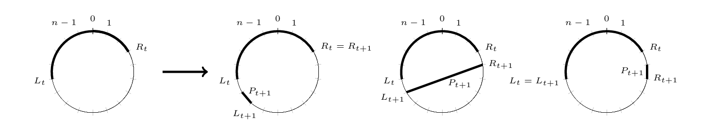
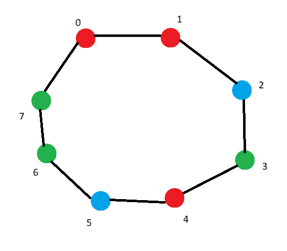

**Goal:** To prove a super tight polynomial separation between multilinear ABPs and multilinear arithmetic formulas. Specifically, to describe a n-variate polynomial F that is computed by a linear-size multilinear ABP but every multilinear formula computing F must be of size $n^{\Omega(logn)}$.

## Basic Definitions

**Multilinear Polynomial**: A polynomial is multilinear if it has degree at most one in each variable.

e.g. determinant, permanent, matrix product.

**Multilinear ABP:** An ABP is multilinear if on every directed path from start-node to end-node no variable appears more than once.

**Multilinear formula:** A formula is multilinear if every sub-formula in it computes a multilinear polynomial.

::: {.callout-note collapse="true"}

### Example:

$f = x_1x_2 + x_2x_3$ is multilinear but $f = x_1x_3+x_2^2$ is not multilinear.
:::

## Main Theorem

::: {.callout-important icon=false}
## Theorem 1.1
For every positive integer n, there is a multilinear polynomial $F=F_n$ in n variables with zero-one coefficients so that the following holds:

1. There is a uniform algorithm that, given n, runs in time O(n) and outputs a multilinear branching program computing F.
2. Over any field, every multilinear formula computing F must be of size $n^{\Omega(logn)}$.

::: 

By setting a lower bound on the complexity of formula and an upper bound on the complexity of ABP, we can prove a polynomial separation between them.

There are two main ideas used in this paper:

- The first is that of a full rank polynomial. A given polynomial f can be used to define a family of matrices $\{M(f_\pi)\}_\pi$ , where $\pi$ ranges over all partitions of the variables X to two sets of variables Y, Z of equal size . The polynomial f is said to have full-rank if the rank of $M(f_\pi)$ is full for every such $\pi$.
- The other is constructing a special set of partitions called arc-partitions. This is a restricted subset of all partitions n! such that it is small enough for an ABP to compute full-rank polynomials, but big enough that formulas cannot compute full rank polynomials.

We are able to make an ABP using an $O(n^2)$ algorithm such that a particular partition is represented by a particular path in ABP and it computes a full rank multilinear polynomial. And we make a probabilistic argument that the polynomial computed by the formula is not full rank for most partitions with very high probability, which implies that a formula cannot compute a full rank polynomial (where the formula is of less than superpolynomial size).

## Preliminaries

### Partial Derivative Matrix

For a multilinear polynomial $f \in \mathbb{F}[Y,Z]$, the partial derivative matrix M(f) is defined such that

$M_{pq}$ = coefficient of $pq$ in $f$

$Y,Z$ are two disjoint sets of variables, p is a monic multilinear monomial in Y and q is a monic multilinear monomial in Z. Size of M is $2^{|y|} * 2^{|z|}$

::: {.callout-note collapse="true"}

### **Example:**

$$
f = 3y_1z_1 + 5y_2z_2 + y_1y_2z_1z_2 \\
Y = \{y_1,y_2\}, Z=\{z_1,z_2\}
$$

Here monic multilinear monomials in Y are $1,y_1,y_2,y_1y_2$ and monic multilinear monomials in Z are $1,z_1,z_2,z_1z_2$. Then the matrix M(f) will be

|      | 1   | z1  | z2  | z1z2 |
| ---- | --- | --- | --- | ---- |
| 1    | 0   | 0   | 0   | 0    |
| y1   | 0   | 3   | 0   | 0    |
| y2   | 0   | 0   | 5   | 0    |
| y1y2 | 0   | 0   | 0   | 1    |

:::

### Rank of the Matrix M

The rank of this matrix is often used as a complexity measure for f.

Some properties of this matrix, given polynomials $f,g \in \mathbb{F}[Y,Z]$

1.  $rank(M(f +g)) <= rank(M(f))+rank(M(g))$
2.  If f, g are over disjoint sets of variables, $rank(M(f.g)) = rank(M(f)). rank(M(g))$
3.  $rank(M(f))<= 2^{min(Y(f),Z(f))}$, where Y(f) is the number of Y variables appearing in f and Z(f) is the number of Z variables appearing in f.

### Arc Partitions

Let $X = \{x_0,x_1...x_{n-1}\}, Y = \{y_0,y_1...y_{n/2}\}$ and $Z = \{z_0,z_1...z_{n/2}\}$, where n is an even integer. We can define a partition $\pi$ as follows-

$$
\pi : X \to Y \cup Z
$$

i..e a perfect matching assigning each $x_i$ to a distinct variable in $Y \cup Z$. Given a polynomial f in the variables X, we can define:

$$
f_\pi = f(\pi(x_0), \pi(x_1) ... \pi(x_{n-1})
$$

Consider a n-cycle graph : graph with n nodes labelled $\{0,1…n-1\}$ and edges between i and (i+1) modulo n.

[i,j] → denotes the arc between i and j i.e. the set of nodes on the path {i,i+1 … j-1,j} on the path from i to j in graph, where $i \neq j$.

The size of the arc is the number of nodes it contains.

Lets construct a arc partition through an example. Here, a pairing is a list of disjoint pairs of nodes in the cycle and we define a distribution $D_p$ on a family of pairings. A random pairing will be constructed in n/2 steps for a n-cycle graph. So, at $t \in [n/2]$, we shall have a pairing $(P_1...P_t)$ of the arc $[L_t,R_t]$

**Example:**

Take an 8-cycle graph with $X = \{0,1,2,3,4,5,6,7\}$. We must create 4 disjoint pairs.

At t=1, $L_1=0, R_1=1$ by definition. So, we have arc [0,1] and $P_1 =\{0,1\}$.

At t=2, we choose $P_2$ by the distribution

$$
P_{t+1} = \begin{cases}
\{L_t- 2,L_t - 1\} & \text{with probability } \frac{1}{3}, \\
\{L_t - 1, R_t+1\} & \text{with probability } \frac{1}{3}, \\
\{R_t + 1, R_t + 2\} & \text{with probability } \frac{1}{3}
\end{cases}
$$

where all arithmetic is modulo 8. So, we have

$$
P_2 = \begin{cases}
\{6,7\} (mod 8) & \text{with probability } \frac{1}{3}, \\
\{7, 2\}(mod 8) & \text{with probability } \frac{1}{3}, \\
\{2, 3\} & \text{with probability } \frac{1}{3}
\end{cases}
$$

Say we choose $P_2=\{7,2\}(mod8)$. The arc expands to include the pair as $[L_{t+1},R_{t+1}] = [L_{t},R_{t}] \cup P_{t+1}$ . Thus, $[L_2,R_2] = [7,2]=\{7,0,1,2\}$.

Image showing the possible choices for the next pair $P_{t+1}$

At t=3, we have the choices {5,6}, {6,3} and {3,4}. Suppose we choose $P_3=\{3,4\}$, we have $[L_3,R_3]=[7,4]=\{7,0,1,2,3,4\}$.

At t=4, we have the choices {5,6}, {6,5} and {5,6}. Say we choose $P_4 = \{5,6\}$, we have $[L_4,R_4]=[7,6]=\{7,0,1,2,3,4,5,6\}$.

The final pairing is $P=(P_1,P_2...P_{n/2}) = (\{0,1\},\{7,2\},\{3,4\},\{5,6\})$.

Given the pairing P ~ DP, we now produce the mapping $\pi$ as follows:

For every pair $P =\{i_t,j_t\}, t \in [n/2]$ independently,

- $\pi(x_{i_t}) = y_t, \pi(x_{j_t}) = z_t$ with probability 1/2
- $\pi(x_{i_t}) = z_t, \pi(x_{j_t}) = y_t$ with probability 1/2

Arc partition distribution is uniform over $3^{n/2}.2^{n/2}$ outcomes. This is much smaller than the n! partitions used in earlier works.

---

## Arc full rank polynomials

f is arc-full-rank if for every partition $\pi$, the partial derivative matrix $M(f(\pi))$ has full rank.

::: {.callout-important icon=false}
## Theorem 3.1
If f is an arc-full-rank multilinear polynomial in n variables over a field F, then any multilinear formula computing f over F has size at least $n^{o(logn)}$
::: 

Let’s set up a proof for the above theorem.

Def: A multilinear polynomial f in variables X is called a (KT)-product polynomial if there exists K disjoint sets of variables $X_1...X_k$, each of size at least T, so that $f=f_1f_2...f_k$ and each $f_k, k \in [K]$, is a multilinear polynomial in $X_k$.

::: {.callout-note collapse="true"}

### Example:

$f=(x_1+2x_2)(3x_3x_4+x_3)(x_5+x_6)$ is a (3,2)-product polynomial:

- $X_1=\{x_1,x_2\}, X_2=\{x_3,x_4\}, X_3=\{x_5,x_6\}$, is a product of k=3 factors having blocks with 2 variables
- $f_1=(x_1+2x_2), f_2=(3x_3x_4+x_3), f_3=(x_5+x_6)$ , each $f_k$ is multilinear and uses variables from its own block

Not all variables in $X_k$ must appear in $f_k$. eg. $f=x_1x_3x_5$ is also a (3,2)-product polynomial.
:::

::: {.callout-tip icon=false}
## Lemma 1 (Shpilka&Yehudayoff)
Any n-variate polynomial f computed by a multilinear formula of size s can be written
as a sum $f=f_1+f_2+...+f_{s+1}$, each $f_i$ is a (KT)-product polynomial with $K \geq (logn)/100$and $T \geq n^{7/8}$.
:::

This reduces the problem to showing each such product polynomial has **low rank** under a random arc-partition.

::: {.callout-tip icon=false}
## Lemma 2

There exists a constant $\delta \gt 0$ so that the following holds. Let n be a large enough even integer. Let f be a (KT)-product polynomial in n variables with $K \geq (logn)/100$ and $T \geq n^{7/8}$. Then

$$
Pr[rank(M(f_\pi)) \geq 2^{n/2 - n^\delta}] \leq n^{-\delta logn}
$$

where $\pi$ ~ D.
:::

I.e., **almost every arc-partition makes the rank drop exponentially**.

The proof of this lemma will be covered soon.

Using these lemmas, we can prove the above theorem.

**Proof by Contradiction:**

Assume there is a multilinear formula $\phi$ of size $s \leq n^{(\delta/2) logn}$ computing a n variate arc-full-rank polynomial f. Let $\pi$ be a random partition according to $D$.

Then, $Pr[rank(M(f_\pi)) = 2^{n/2}] = 1$ for an arc-full-rank f.

From Lemma 1, $f=f_1+f_2+...+f_{s+1}$. Let us apply the partition to this,

$f_\pi=(f_1)_\pi+(f_2)_\pi+...+(f_{s+1})_\pi$. Then, $M(f_{\pi}) = M\!\left( \sum_{i=1}^{s+1} (f_i)_{\pi} \right).$

$Rank(M(f_{\pi})) \leq \sum_{i=1}^{s+1}Rank(M\!\left(  (f_i)_{\pi} \right))$ using property 1.

The sum of these s+1 non-negative terms is at least $2^{n/2}$.

$\exists i \in [s+1]$ with rank $Rank(M((f_i)_\pi)) \geq 2^{n/2}/(s+1)$ (Pigeonhole)

$$
Pr[rank(M(f_\pi)) = 2^{n/2}] \leq Pr[rank(M((f_i)_\pi)) \geq 2^{n/2}/(s+1)]
$$

Using the union bound,

$$
Pr[rank(M(f_\pi)) = 2^{n/2}] \leq \sum_{i=1}^{s+1}Pr[rank(M((f_i)_\pi)) \geq 2^{n/2}/(s+1)]
$$

Choose n large enough, $\delta > 0$, such that $2^{n/2}/(s+1) > 2^{n/2-n^\delta}$. Using lemma 2,

$$
\sum_{i=1}^{s+1}Pr[rank(M((f_i)_\pi)) \geq 2^{n/2-n^\delta}] \leq (s+1) n^{-\delta logn}
$$

Since $s \leq n^{(\delta/2) logn}$, then $(s+1) n^{-\delta logn} \leq 2n^{-\delta/2logn}$, as $n \to \infin$ this becomes <1. Putting it together,

$$
Pr[rank(M(f_\pi)) = 2^{n/2}] < 1
$$

This is a contradiction! Hence, our assumption is incorrect.
Thus, we have proved part 2 of theorem 1.1.
## Construction of ABP for arc full rank polynomial

So, we will construct an ABP in which every path between start-node and end-node corresponds to a specific execution of the random process which samples arc-partitions.

Let us construct an ABP through an example. Each node in the ABP corresponds to an arc [L,R], which sends an edge to each of the nodes [L-2,R], [L-1,R+1] and [L,R+2]. The edges have specially chosen labels that guarantee full rank w.r.t. to every arc-partition. The start node is the empty arc $\phi$, the end node is the whole cycle [n] and intermediate nodes are even sized arcs on the cycle.

**Example:**

Let us construct an ABP for 8-cycle graph. We have $X=\{x_0,x_1,x_2,x_3,x_4,x_5,x_6,x_7\}$ and $\Lambda = \{\lambda_e\}$

At t=0, we know the start node is $\phi$

At t=1, there is only one node [0,1]. We connect the start node to it with edge $\lambda_e(x_0+x_1)$.

At t>1, for any node [L,R] of size 2t, we add 3 edges:

- Edge $e_1$ between [L,R] and [L-2,R] is labelled $\lambda_{e_1}(x_{L-2}+x_{L-1})$
- Edge $e_2$ between [L,R] and [L-1,R+1] is labelled $\lambda_{e_2}(x_{L-1}+x_{R+1})$
- Edge $e_3$ between [L,R] and [L,R+2] is labelled $\lambda_{e_3}(x_{R+1}+x_{R+2})$

Then, we can see that for every path $\gamma$ from start-node to end-node in the ABP, the list of edges along $\gamma$ yields a pairing P, every edge e in $\gamma$ corresponds to a pair $P_e=\{i_e,j_e\}$ of nodes in the n-cycle. Thus,

$$
F = \sum_{\gamma} \prod_{e \in \gamma} \lambda_e \;\cdot\; \prod_{e \in \gamma} (x_{i_e} + x_{j_e})
$$

This ABP is multilinear : because every path is a multiplication as above in which each $x_i$ appears at most once. The size of this ABP is $O(n^2)$ since there are n even sized arcs possible for each arc size and the arc sizes are 0,2,4 → n i.e. n different sizes.

F has zero-one coefficients since given the $\prod_{e \in \gamma} \lambda_e$ we can reconstruct $\pi$ (since it is unique to $\gamma$).

Mainly, we have to show that F is arc full rank i.e. for any arc-partition $\pi$, the matrix $M(F_\pi)$ has full rank $2^{n/2}$. We know that the arc-partition $\pi$ comes from the pairing $P = P(\pi)$ which corresponds to a path $\gamma = \gamma(\pi)$. Consider the polynomial f obtained from $F_\pi$ by setting $\lambda_e  = 1$ for every e in $\gamma$, and $\lambda_e  = 0$ for every e not in $\gamma$. Then the resulting polynomial, after applying $\pi$ is:

$$
f_\pi = \prod_{t \in [n/2]} (y_t + z_t)
$$

For any $y_t,z_t$ we can write $M(y_t + z_t) = \begin{pmatrix}0 & 1 \\1 & 0\end{pmatrix},$ which clearly has rank 2 over the field F. Then by property 2, we know that rank of M(f) is full. Then using Lemma 3 (below), we can say that the rank of $M(F_\pi)$ over $F(\Lambda)$ is atleast the rank of M(f) over field F. Hence, we can write the theorem:

::: {.callout-important icon=false}
## Theorem 3.4

Over every field $\mathbb{F}$, the polynomial $F = F_n$ defined above satisfies the following:

1.  F is computed by a linear-size (in the number of variables, which is $O(n^2)$) multilinear ABP. The ABP for F can be constructed uniformly in time $O(n^2)$.
2.  F has zero-one coefficients.
3.  F is arc-full-rank as a polynomial in the variables X over the field $\mathbb{F}(\Lambda)$ of rational functions in $\Lambda$
::: 

::: {.callout-tip icon=false}
## Lemma 3
Let K be a field and consider L, the field of rational functions $K(\lambda_1,\ldots,\lambda_m)$. If f is a polynomial in L[Y,Z] and $a_1,\ldots,a_m$ are elements of K, let g be the polynomial in K[Y,Z] obtained from f by substituting $\lambda_i$ with $a_i$. Then the rank over K of M(g) is at most the rank over L of M(f).
:::

Thus, we have been able to describe a n-variate polynomial f which can be computed by the linear-size ABP F but cannot be computed by a multilinear formula $\phi$ of size $s \leq n^{\Omega(logn)}$.
Thus, we have proved part 1 of theorem 1.1.

## Arc-partitions and product polynomials

We still need to prove Lemma 2. Let’s restate it:

**Lemma 2:** There exists a constant $\delta \gt 0$ so that the following holds. Let n be a large enough even integer. Let f be a (KT)-product polynomial in n variables with $K \geq (logn)/100$ and $T \geq n^{7/8}$. Then $P[rank(M(f_\pi)) \geq 2^{n/2 - n^\delta}] \leq n^{-\delta logn}$ where $\pi$ ~ D.

Let S be a partition of the n-cycle to K parts, namely $S = (S_1, S_2 \dots S_k)$ where $\bigcup_{k \in [K]} S_k$ is the whole cycle and $S_k \cap S_{k'} = \varnothing \quad \text{for all } k \ne k' \text{ in } [K].$

Think of [K] as a set of colors and S as a coloring of the cycle.

For a pairing P, define the number of k-violations as:

$$
 V_k(P) = \{\, P_t \in P : P_t \cap S_k = 1 \,\}

$$

i.e. the set of pairs in which one color is k and the other color is different.

$$
G(P) = \bigl|\{\, k \in [K] : |V_k(P)| \ge n^{1/1000} \,\}\bigr|.
$$

V(P) defines how many edges leave color k and G(P) is the set of colors that have lots of such edges.

::: {.callout-note collapse="true"}

### Example:

n =8, k =3. $P= (\{0,1\},\{7,2\},\{3,4\},\{5,6\})$

$S_1=\{0,1,4\}$ (red), $S_2=\{2,5\}$ (blue), $S_3=\{3,6,7\}$ (green).

For k=1, lets go through the pairs in P:

- {0,1} both are in $S_1$
- {7,2} both are not in $S_1$
- {3,4} only 4 in $S_1$
- {5,6} both not in $S_1$

Hence $|V_1(P)| = 1$.

Similarly, $|V_2(P)|=2,|V_3(P)|=2.$

Here n=8, so $n^{1/1000}$ is roughly 1. Then, $G(P)=3$.

We can think of a color as a group, and a node in the color group with an edge to another color’s node has a cross edge.
:::

::: {.callout-tip icon=false}
## Lemma 4
There exists a constant C > 0 such that for all $C \leq K \leq n^{1/1000}$ the following holds:
Let $S = (S_1, S_2 \dots S_k)$ be a partition of the n-cycle and suppose that $|S_k| \geq n^{7/8} \forall k \in [K]$. Then,

$$
Pr[G(P)\leq K/1000]\leq n^{-\Omega(K)}
$$

where P ~ $D_P$.
:::

We will prove this lemma in the next section. It is saying that the probability that few colors have many cross edges is very low. Or equivalently, with overwhelming probability, _many_ colors have many cross-edges.

**Proof:**

Let f be a (K,T)-product with $K = \left\lceil \frac{\log n}{100} \right\rceil
, T = \left\lceil n^{7/8} \right\rceil$
, partition S of the cycle made by variables of f. Let P~DP, $\pi$~D be a random partition obtained from P. For every P, define a graph H(P) such that:

- Nodes of H(P) are colors k in [K] so that $|V_k(P)| \geq n^{1/1000}$
- Every two nodes $k \neq k'$ in G(P) are connected by an edge if $|V_k(P) \cap V_{k'}(P)| \geq n^{1/1500}$
- The degree of each node in H(P) is atleast 1.
  If degree of node k in H(P) is 0, no more than $n^{1/1500}$ edges connect it to k’. Then the total number of pairs from k to all other colors in H(P) is $\leq (G(P)-1).n^{1/1500}$ that is $\leq k.n^{1/1500}$. Then the total number of edges from k color node is $|V_k(P)| \leq k.n^{1/1500} = logn.n^{1/1500}$. But $V_k(P)\geq n^{1/1000}$.

Claim: Let H be a graph with minimal degree at least one and M nodes, then there is a subset $\{h_1 \dots h_N\}$ of the nodes of H of size $N \geq M/2 -1$, so that for every $j \in [N-1]$, the degree of $h_{j+1}$ in the graph induced on the nodes not in $\{h_1 \dots h_j\}$ is at least one.

**Proof by induction:**

Base case M≤2, if M = 1, degree ≥1 not possible! If M=2, the two nodes are connected to each other, we can pick either one and we are done.

So for M > 2,

Pick $h_1$ - the node having least degree, and consider the graph $H_1$ having removed that node.

$H_1$ has at most one isolated (degree=0) node, lets call it $h_1'$.

Now consider the graph removing $\{h_1,h_1'\}$ having M-2 nodes which would also have minimal degree ≥ 1. We can say that there is a subset $\{h_2 \dots h_N\}$ to satisfy the claim where N ≥ M/2 -2. We can add $h_1$ back to get N+1 ≥ M/2 -1. At each step we can remove 1 or 2 nodes such that we get a sequence $\{h_1 \dots h_N\}$ that satisfies the claim.

Now we have H(P) with M=|G(P)| and minimal degree≥1. Then there is a subset of colors $\{k_1 \dots k_{K'}\}$ with K’ ≥ |G(P)|/2 -1 such that the claim above is fulfilled.

View the sampling of $\pi$ from P as happening in the sequence $k_1 \dots k_{K'}$, first for all pairs touching $k_1$, then for remaining pairs touching $k_2$ and so on. For each color $k_j$ that has not been considered yet, there are still many cross pairs connecting it to other colors.

For every $j \in [K]$, define $E_j$ to be the event that $|Y_{k_j}-|S_{k_j}|/2| \leq n^{1/5000}$, where $Y_{k_j}=|\pi^{-1}(Y)\cap S_{k_j}|$. Remember, this $Y_{k_j}$ just means variables in X that will map to variables in Y and that have color $k_j$. So, the event $E_j$ means that the color $k_j$ is roughly balanced between Y and Z. Since $|S_k| \geq n^{7/8}$ this is a pretty small error window around half.

Now, conditioned on $E_1 \dots E_j$, there are at least $n^{1/1500}$ pairs $P_t$ such that $|P_t \cap S_{k_j}|=1$ are not yet assigned variables in Y,Z (since at step j+1, color $k_{j+1}$ still has a neighbour k’ in $k_{j+2}...k_{K'}$.

Then, the element in $P_t \cap S_{k_j}$ is assigned a Y variable with probability 1/2, for each, independently of any other $P_t$. Then for this event, the universe is $U \geq n^{1/1500}$ and the marginal is 1/2, which is like a binomial random variable B with U independent fair coin tosses. Then for any specific k,

$$
Pr[B=k]=O(1/\sqrt(U)) \leq O(n^{-1/3000})
$$

Hence, for all $j \in [K]$, we find the conditionally probability for event $E_j$,

$$
\mathbb{P}[E_j \mid E_1, \ldots, E_{j-1}, P]\;\le\;\mathbb{P}_B\!\left[\, U/2 - n^{1/5000} \;\le\; B \;\le\; U/2 + n^{1/5000} \,\right]\;\le\;O\!\left( 2 n^{1/5000} n^{-1/3000} \right)\;\le\;n^{-\Omega(1)}
$$

By chain rule, $\mathbb{P}[\text{all balanced} \mid P] \le n^{-\Omega(G(P))}$. Average this over all pairings for G(P) ≥ K/1000,

$\mathbb{P}[\text{all balanced}∣G(P)>K/1000]≤\mathbb{E}\!\left[\, n^{-\Omega(G(P))} \,\middle|\, G(P) > K/1000 \right] \leq n^{-\Omega(k)}$

We can use Bayes theorem,

$$
\mathbb{P}[\text{all colors balanced}]=\mathbb{P}[\text{all balanced} \mid G(P) > K/1000] \cdot \mathbb{P}[G(P) > K/1000]\;+\;\mathbb{P}[\text{all balanced} \mid G(P) \le K/1000] \cdot \mathbb{P}[G(P) \le K/1000]
$$

Using Lemma 4,

$$
\mathbb{P}\!\left[\, |Y_k - |S_k|/2| \le n^{1/5000} \;\text{ for all } k \in [K] \,\right]\;\le\;\mathbb{E}\!\left[\, n^{-\Omega(G(P))} \,\middle|\, G(P) > K/1000 \right]\;+\;n^{-\Omega(K)}\;=\;n^{-\Omega(\log n)}
$$

Using Property 2&3, $\operatorname{rank}(M(f^{\Pi}))\;\le\;\prod_{k=1}^{K} 2^{\min(Y_k, Z_k)}\;=\;2^{\sum_{k=1}^{K} \min(Y_k, Z_k)}$

$\min(Y_k, Z_k)
= \frac{Y_k + Z_k}{2} - \frac{\lvert Y_k - Z_k\rvert}{2},
Y_k + Z_k = |S_k|$, then $\min(Y_k, Z_k)
= \frac{|S_k|}{2} - \lvert Y_k-\frac{|S_k|}{2}\rvert$

Then, $\sum_{k=1}^{K} \min(Y_k, Z_k) = \frac{n}{2} - \sum_{k=1}^{K} \lvert Y_k-\frac{|S_k|}{2}\rvert$.

Suppose there is some k that is unbalanced, $\sum_{k=1}^{K} \lvert Y_k-\frac{|S_k|}{2}\rvert \geq \lvert Y_k-\frac{|S_k|}{2}\rvert \gt n^{1/5000}$.

Then, $\operatorname{rank}(M(f^{\Pi})) \lt 2^{\,n/2 - n^{1/5000}}$, or taking the contrapositive, we get the below equation

$$
\mathbb{P}\!\left[\, \operatorname{rank}(M(f_{\Pi})) \ge 2^{\,n/2 - n^{1/5000}} \right]\;\le\;\mathbb{P}\!\left[\, |Y_k - |S_k|/2| \le n^{1/5000} \;\text{ for all } k \in [K] \,\right] \leq n^{-\Omega(\log n)}
$$

Hence, we have proved Lemma 3.

The proof for Lemma 4 is remaining, but I leave it for the future.

The main insight is that multilinear formulas necessarily break their input variables into many “color blocks”, and for the polynomial to have full rank under any partition, each block must split almost perfectly evenly between Y and Z. But a random arc-partition almost never splits _all_ blocks evenly; since the probability that the binomial will land in a tiny window around its mean is small to evenly split any given block is small, and for this to happen for a k blocks is very unlikely. This forces every small formula to fail rank-fullness, while the explicitly constructed ABP-based polynomial always maintains full rank. Hence formulas need superpolynomial size, whereas ABPs do not.

### Citation

Zeev Dvir, Guillaume Malod, Sylvain Perifel, and Amir Yehudayoff. 2012. Separating multilinear branching programs and formulas. In Proceedings of the forty-fourth annual ACM symposium on Theory of computing (STOC '12). Association for Computing Machinery, New York, NY, USA, 615–624. https://doi.org/10.1145/2213977.2214034

A. Shpilka and A. Yehudayo . Arithmetic circuits: A survey of recent results and open questions. Found. Trends Theor. Comput. Sci. 5, pages 207388, 2010.

P.S. I have maintained the same theorem numbering from the paper, but the lemma numbering is mismatched.